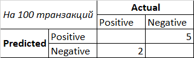
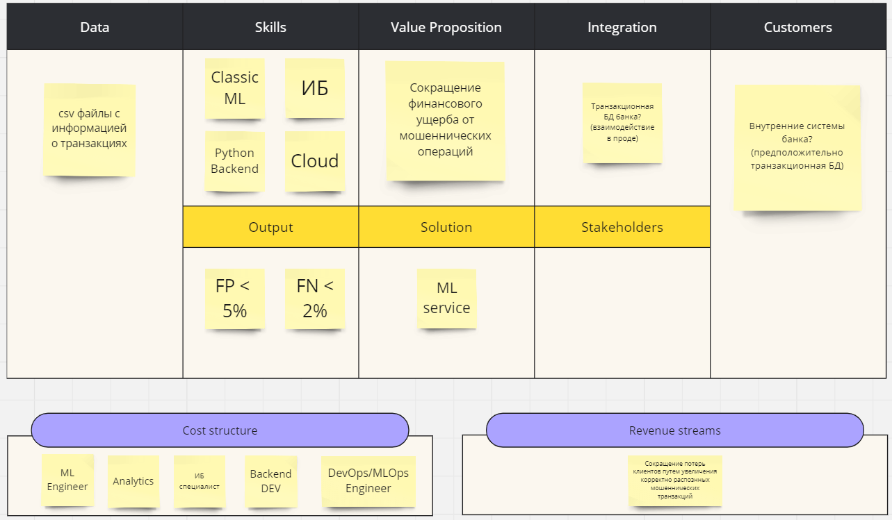
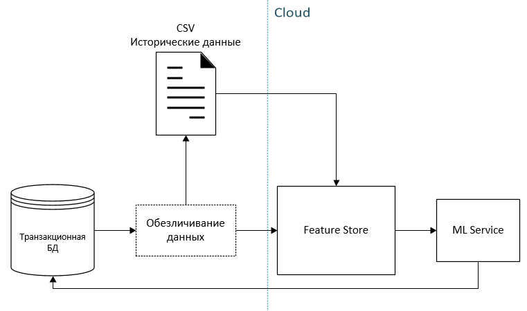
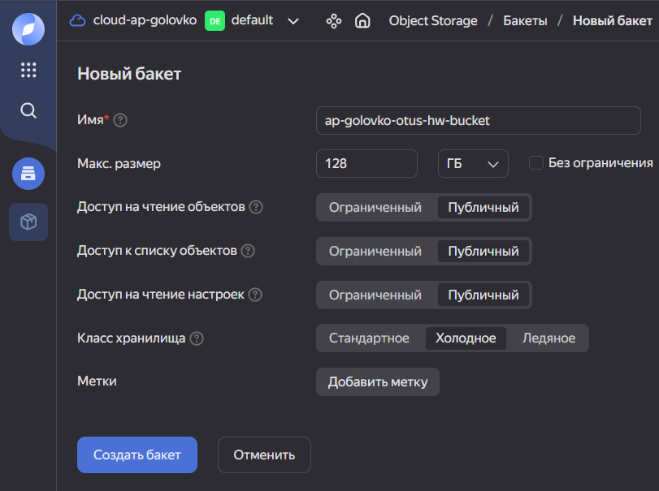
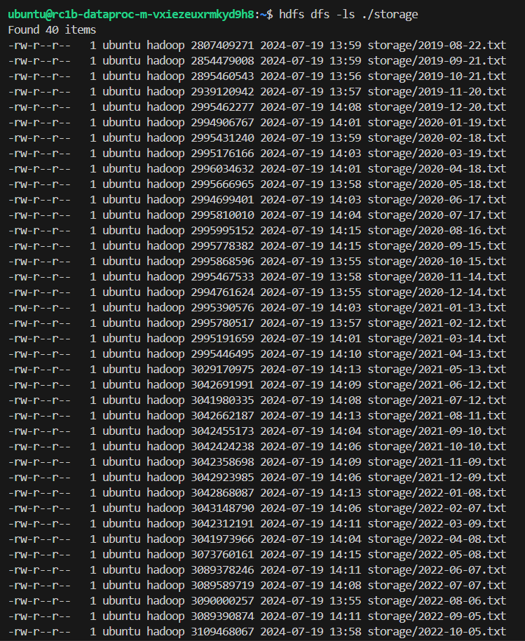

# Предварительный анализ задачи определения мошеннических финансовых операций
Антифрод-система распознавания мошеннеческих транзакций.

## Требования и ограничения
1. 10кк на реализацию, 3 месяца на MVP, 6 месяцев на реализацию
2. Выявление минимум 2-ух мошеннических операций на 100 транзакций (общий ущерб от 2-ух мошеннических операций ~500к)
3. 50 транзакций/с в среднем, до 400 транзакций/с перед праздниками
4. Доля ложно распознанных как мошеннических транзакций менее 5%
5. On Cloud решение
6. Конфиденциальные данные

## Цель системы
Сокращение финансового ущерба от мошеннических операций путем выявления мошеннических транзакций.

## Метрики
Исходя из требований к системе (Positive=Мошенническая)



Имеем следующие ограничения:
1. FP (%) должен быть менее 5%
2. FN (%) должен быть менее 2%

В качестве целевой метрики можем выбрать TPR (Recall), которая будет показывать нам процент удачно распозннаных мошеннических операций из всех мошеннических операций. Но при выборе модели необходимо также учитвать ограничения выше!

Используя TP мы также можем расчитать бизнесс-value. Исходя из вводных задачи, 1 мошенническая транзакция может наносить до 250к ущерба. При помощи TP можно оценить какой ущерб удалось бы избежать при использовании модели:
TP * 250 000.

## Canvas

[Ссылка на Canvas](https://miro.com/app/board/uXjVK44dQD8=/?share_link_id=413863632248)

Не обговоренные выше поинты которые учтены на Canvas:
1. Потребуется ИБ специалист т.к. работаем с конфиденциальными данными
2. On Cloud решение, требуются компетенции для работы с облаком
3. CSV-файлы выгружаемые за определенный период не подойдут для прода т.к. решение о том является ли операция мошеннической необходимо в real-time, скорее всего потребуется интеграция с транзакционной системой банка.

## Предполагаемая архитектура решения


1. Обезличивание данных - некоторый процесс который необходимо реализовать на стороне заказчика при выгрузке данных из транзакционной системы (что именно это будет пока не ясно)
2. Feature Store для непрерывного доступа ML сервиса к данным, также выполняет роль интеграционного слоя
3. ML Service - Python сервис (в Docker) выполняет следующие задачи:
    1. Непрерывно считывает фичи транзакций из Feature Store
    2. Выполняет классификацию транзакций при помощи предварительно обученной модели
    3. Отправляет информацию о классе транзакции обратно в транзакционную систему (как происходит взаимодействие с транзакционной системой будет зависеть от того что это за система, пока процедура не ясна)

При увеличении нагрузок (перед праздниками) необходимо также учесть возможность подьема несколькоих инстансев ML срвиса.

# Настройка облачной инфраструктуры

## Object Storage
Настройки при создании бакета:


Бакет с данными: `s3://ap-golovko-otus-hw-bucket/`.

Команда копирования данных из источника:
```bash
s3cmd --storage-class COLD sync s3://otus-mlops-source-data/ s3://ap-golovko-otus-hw-bucket/ --acl-public
```

## Cluster
Скрины настроек кластера и прочих компонент в директории `resources/img`, см. файлы с префиксом `hw2-yc`.

Команда для копирования данных из s3 в кластер (предварительно создана директория `./storage` с помошью `hdfs dfs -mkdir ./storage`):
```bash
hadoop distcp s3a://ap-golovko-otus-hw-bucket/ ./storage
```

Файлы после копирования в кластер:

